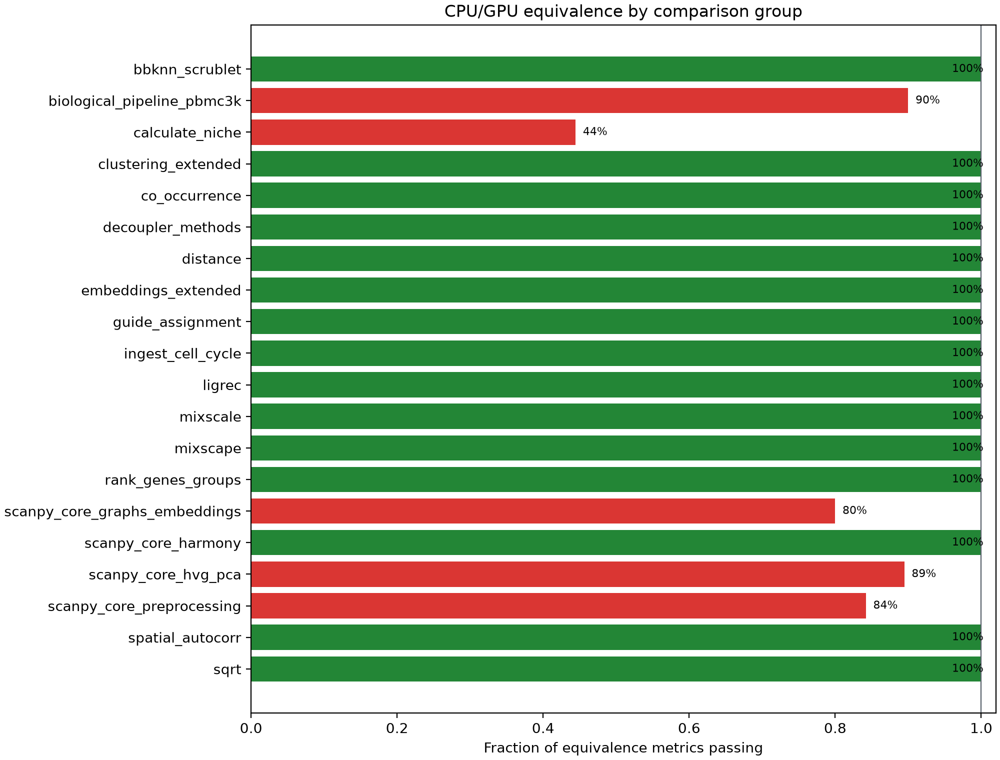

# CPU/GPU equivalence report

Generated 2026-08-10T09:11:32.844594+00:00 from isolated comparison processes.

## Outcome

- Overall: **FAIL**
- Method groups passing: **15/20**
- Gating metrics passing: **149/161**
- Additional measurements recorded as evidence: **232**
- Scripts completing successfully: **20/20**

## Software versions

| Package | Version(s) |
| --- | --- |
| decoupler | 2.2.0 |
| harmonypy | 0.2.0 |
| pertpy | 1.1.1 |
| rapids-singlecell | 0.16.1 |
| scanpy | 1.12.3 |
| squidpy | 1.8.3 |

## Method groups

| Method group | Reference | Dataset | Tier | Result | Metrics |
| --- | --- | --- | --- | --- | ---: |
| `bbknn_scrublet` | scanpy | pbmc68k_reduced + pbmc3k | stochastic | PASS | 5/5 |
| `biological_pipeline_pbmc3k` | scanpy | pbmc3k_processed raw log-expression with published cell-type labels | biological | FAIL | 9/10 |
| `calculate_niche` | squidpy | squidpy.datasets.imc | stochastic | FAIL | 4/9 |
| `clustering_extended` | scanpy | scanpy.datasets.pbmc68k_reduced | stochastic | PASS | 4/4 |
| `co_occurrence` | squidpy | squidpy.datasets.imc | deterministic | PASS | 4/4 |
| `decoupler_methods` | decoupler | decoupler.ds.toy | deterministic | PASS | 9/9 |
| `distance` | pertpy | seeded grouped Gaussian data | deterministic | PASS | 9/9 |
| `embeddings_extended` | scanpy | scanpy.datasets.pbmc68k_reduced | stochastic | PASS | 6/6 |
| `guide_assignment` | pertpy | seeded Poisson guide-count mixture | near-deterministic | PASS | 3/3 |
| `ingest_cell_cycle` | scanpy | scanpy.datasets.pbmc68k_reduced | near-deterministic | PASS | 6/6 |
| `ligrec` | squidpy | scanpy.datasets.paul15 | stochastic | PASS | 4/4 |
| `mixscale` | pertpy | seeded synthetic perturbation screen | deterministic | PASS | 1/1 |
| `mixscape` | pertpy | seeded synthetic perturbation screen | near-deterministic | PASS | 4/4 |
| `rank_genes_groups` | scanpy | scanpy.datasets.pbmc68k_reduced | near-deterministic | PASS | 36/36 |
| `scanpy_core_graphs_embeddings` | scanpy | pbmc68k_reduced | stochastic | FAIL | 4/5 |
| `scanpy_core_harmony` | harmonypy | Harmonypy PBMC 3,500-cell donor benchmark | iterative | PASS | 3/3 |
| `scanpy_core_hvg_pca` | scanpy | pbmc3k | deterministic | FAIL | 17/19 |
| `scanpy_core_preprocessing` | scanpy | pbmc3k | deterministic | FAIL | 16/19 |
| `spatial_autocorr` | squidpy | squidpy.datasets.imc | deterministic | PASS | 4/4 |
| `sqrt` | scanpy | scanpy.datasets.pbmc3k | deterministic | PASS | 1/1 |

## Failed metrics

A criterion is never widened to make a run green. Where a failure has been investigated, what the investigation found is recorded with it.

| Method group | Metric | Observed | Criterion | Why it fails |
| --- | --- | ---: | --- | --- |
| `biological_pipeline_pbmc3k` | `umap.cross_embedding_knn_overlap` | 0.40189538 | >= 0.6 | UMAP is stochastic, and this threshold asks for more agreement than the CPU reference shows against itself. Compare `umap.cpu_reseeded_knn_overlap`, the same measurement with only the seed changed, and `umap.cross_embedding_overlap_vs_cpu_baseline`. |
| `calculate_niche` | `neighborhood.adjusted_rand_index` | 0.85900898 | >= 0.9 | The neighborhood profile holds only 755 distinct rows across 4668 cells, so 89.67% of cells have an exact distance tie at the k-th neighbour. Against exact float64 ground truth the GPU kNN is exact and `sc.pp.neighbors` is not, on 743 rows: the divergence is the CPU reference. |
| `calculate_niche` | `neighborhood.normalized_mutual_information` | 0.80667388 | >= 0.9 | The neighborhood profile holds only 755 distinct rows across 4668 cells, so 89.67% of cells have an exact distance tie at the k-th neighbour. Against exact float64 ground truth the GPU kNN is exact and `sc.pp.neighbors` is not, on 743 rows: the divergence is the CPU reference. |
| `calculate_niche` | `neighborhood.cluster_count_difference` | 11 | <= 1.0 | `resolution` does not carry the same meaning across Leiden implementations: on identical input cuGraph found 34 clusters where leidenalg found 41, and Scanpy's own two backends already differ by 1. |
| `calculate_niche` | `utag.adjusted_rand_index` | 0.55462722 | >= 0.85 | Squidpy calls `sc.tl.leiden` without a flavor, so CPU and GPU use different Leiden backends. On identical input Scanpy's own leidenalg and igraph backends agree only at ARI 0.5041, below this threshold, so the criterion measures backend choice rather than correctness. |
| `calculate_niche` | `utag.normalized_mutual_information` | 0.73327271 | >= 0.85 | Squidpy calls `sc.tl.leiden` without a flavor, so CPU and GPU use different Leiden backends. On identical input Scanpy's own leidenalg and igraph backends agree only at ARI 0.5041, below this threshold, so the criterion measures backend choice rather than correctness. |
| `scanpy_core_graphs_embeddings` | `umap.cross_embedding_knn_overlap` | 0.58847619 | >= 0.65 | UMAP is stochastic, and this threshold asks for more agreement than the CPU reference shows against itself. On this dataset the GPU embedding is closer to the CPU one than a reseeded CPU run is, and the criterion still fails. |
| `scanpy_core_hvg_pca` | `highly_variable_genes.seurat.dispersions_norm.allclose_excess` | 3.4642374 | <= 1.0 | numpy.allclose has two terms, atol + rtol * |b|, and which one binds depends on the magnitude of the element that fails. Where a quantity passes through zero the absolute floor binds, and at float32 precision no implementation can satisfy it there. See NUMERICAL_VALIDATION.md for the per-comparison split between that case and a genuine relative disagreement. |
| `scanpy_core_hvg_pca` | `highly_variable_genes.cell_ranger.dispersions_norm.allclose_excess` | 13.067911 | <= 1.0 | numpy.allclose has two terms, atol + rtol * |b|, and which one binds depends on the magnitude of the element that fails. Where a quantity passes through zero the absolute floor binds, and at float32 precision no implementation can satisfy it there. See NUMERICAL_VALIDATION.md for the per-comparison split between that case and a genuine relative disagreement. |
| `scanpy_core_preprocessing` | `normalize_pearson_residuals.allclose_excess` | 30.626773 | <= 1.0 | numpy.allclose has two terms, atol + rtol * |b|, and which one binds depends on the magnitude of the element that fails. Where a quantity passes through zero the absolute floor binds, and at float32 precision no implementation can satisfy it there. See NUMERICAL_VALIDATION.md for the per-comparison split between that case and a genuine relative disagreement. |
| `scanpy_core_preprocessing` | `scale.allclose_excess` | 1.7870379 | <= 1.0 | numpy.allclose has two terms, atol + rtol * |b|, and which one binds depends on the magnitude of the element that fails. Where a quantity passes through zero the absolute floor binds, and at float32 precision no implementation can satisfy it there. See NUMERICAL_VALIDATION.md for the per-comparison split between that case and a genuine relative disagreement. |
| `scanpy_core_preprocessing` | `regress_out.allclose_excess` | 67.439148 | <= 1.0 | numpy.allclose has two terms, atol + rtol * |b|, and which one binds depends on the magnitude of the element that fails. Where a quantity passes through zero the absolute floor binds, and at float32 precision no implementation can satisfy it there. See NUMERICAL_VALIDATION.md for the per-comparison split between that case and a genuine relative disagreement. |

## Recorded measurements (not gating)

These quantify behaviour rather than test CPU/GPU equivalence, so they are reported without deciding the outcome.

| Method group | Measurement | Observed | Why it is not a criterion |
| --- | --- | ---: | --- |
| `biological_pipeline_pbmc3k` | `umap.cpu_reseeded_knn_overlap` | 0.40328532 |  |
| `biological_pipeline_pbmc3k` | `umap.cross_embedding_overlap_vs_cpu_baseline` | -0.0013899419 |  |
| `biological_pipeline_pbmc3k` | `markers.B cells.set_jaccard` | 1 |  |
| `biological_pipeline_pbmc3k` | `markers.CD14+ Monocytes.set_jaccard` | 1 |  |
| `biological_pipeline_pbmc3k` | `markers.CD4 T cells.set_jaccard` | 1 |  |
| `biological_pipeline_pbmc3k` | `markers.CD8 T cells.set_jaccard` | 1 |  |
| `biological_pipeline_pbmc3k` | `markers.Dendritic cells.set_jaccard` | 1 |  |
| `biological_pipeline_pbmc3k` | `markers.FCGR3A+ Monocytes.set_jaccard` | 1 |  |
| `biological_pipeline_pbmc3k` | `markers.Megakaryocytes.set_jaccard` | 1 |  |
| `biological_pipeline_pbmc3k` | `markers.NK cells.set_jaccard` | 1 |  |
| `co_occurrence` | `interval.allclose_worst_magnitude` | 20.911736 |  |
| `co_occurrence` | `interval.allclose_violating_fraction` | 0 |  |
| `co_occurrence` | `interval.max_abs_error` | 0 |  |
| `co_occurrence` | `interval.max_rel_error` | 0 |  |
| `co_occurrence` | `occurrence.allclose_worst_magnitude` | 0.98842989 |  |
| `co_occurrence` | `occurrence.allclose_violating_fraction` | 0 |  |
| `co_occurrence` | `occurrence.max_abs_error` | 1.4481226e-06 |  |
| `co_occurrence` | `occurrence.max_rel_error` | 2.246368e-07 |  |
| `decoupler_methods` | `aucell.score.allclose_excess` | 0.0051959217 |  |
| `decoupler_methods` | `aucell.score.allclose_worst_magnitude` | 0.26666667 |  |
| `decoupler_methods` | `aucell.score.allclose_violating_fraction` | 0 |  |
| `decoupler_methods` | `aucell.score.max_abs_error` | 1.9868215e-08 |  |
| `decoupler_methods` | `aucell.score.max_rel_error` | 1.9868215e-08 |  |
| `decoupler_methods` | `mlm.adjusted_pvalue.allclose_excess` | 1.820935 |  |
| `decoupler_methods` | `mlm.adjusted_pvalue.allclose_worst_magnitude` | 0.97868647 |  |
| `decoupler_methods` | `mlm.adjusted_pvalue.allclose_violating_fraction` | 0.0075 |  |
| `decoupler_methods` | `mlm.adjusted_pvalue.max_abs_error` | 1.7839454e-05 |  |
| `decoupler_methods` | `mlm.adjusted_pvalue.max_rel_error` | 1.7994235e-05 |  |
| `decoupler_methods` | `mlm.score.allclose_excess` | 3.8954457 |  |
| `decoupler_methods` | `mlm.score.allclose_worst_magnitude` | 0.010860395 |  |
| `decoupler_methods` | `mlm.score.allclose_violating_fraction` | 0.005 |  |
| `decoupler_methods` | `mlm.score.max_abs_error` | 4.143194e-06 |  |
| `decoupler_methods` | `mlm.score.max_rel_error` | 4.446138e-07 |  |
| `decoupler_methods` | `ulm.adjusted_pvalue.allclose_excess` | 21.178564 |  |
| `decoupler_methods` | `ulm.adjusted_pvalue.allclose_worst_magnitude` | 0.99754399 |  |
| `decoupler_methods` | `ulm.adjusted_pvalue.allclose_violating_fraction` | 0.0025 |  |
| `decoupler_methods` | `ulm.adjusted_pvalue.max_abs_error` | 0.00021147728 |  |
| `decoupler_methods` | `ulm.adjusted_pvalue.max_rel_error` | 0.00021199795 |  |
| `decoupler_methods` | `ulm.score.allclose_excess` | 0.62557934 |  |
| `decoupler_methods` | `ulm.score.allclose_worst_magnitude` | 0.0030984378 |  |
| `decoupler_methods` | `ulm.score.allclose_violating_fraction` | 0 |  |
| `decoupler_methods` | `ulm.score.max_abs_error` | 3.880607e-06 |  |
| `decoupler_methods` | `ulm.score.max_rel_error` | 4.5916409e-07 |  |
| `decoupler_methods` | `waggr.adjusted_pvalue.allclose_excess` | 0 |  |
| `decoupler_methods` | `waggr.adjusted_pvalue.allclose_worst_magnitude` | 1 |  |
| `decoupler_methods` | `waggr.adjusted_pvalue.allclose_violating_fraction` | 0 |  |
| `decoupler_methods` | `waggr.adjusted_pvalue.max_abs_error` | 0 |  |
| `decoupler_methods` | `waggr.adjusted_pvalue.max_rel_error` | 0 |  |
| `decoupler_methods` | `waggr.score.allclose_excess` | 0.71895189 |  |
| `decoupler_methods` | `waggr.score.allclose_worst_magnitude` | 0.017656257 |  |
| `decoupler_methods` | `waggr.score.allclose_violating_fraction` | 0 |  |
| `decoupler_methods` | `waggr.score.max_abs_error` | 1.2449623e-06 |  |
| `decoupler_methods` | `waggr.score.max_rel_error` | 1.274507e-07 |  |
| `decoupler_methods` | `zscore.adjusted_pvalue.allclose_excess` | 0.14219173 |  |
| `decoupler_methods` | `zscore.adjusted_pvalue.allclose_worst_magnitude` | 0.017339345 |  |
| `decoupler_methods` | `zscore.adjusted_pvalue.allclose_violating_fraction` | 0 |  |
| `decoupler_methods` | `zscore.adjusted_pvalue.max_abs_error` | 2.3841858e-07 |  |
| `decoupler_methods` | `zscore.adjusted_pvalue.max_rel_error` | 4.1003049e-07 |  |
| `decoupler_methods` | `zscore.score.allclose_excess` | 0.053337029 |  |
| `decoupler_methods` | `zscore.score.allclose_worst_magnitude` | 0.5512454 |  |
| `decoupler_methods` | `zscore.score.allclose_violating_fraction` | 0 |  |
| `decoupler_methods` | `zscore.score.max_abs_error` | 1.1061835e-06 |  |
| `decoupler_methods` | `zscore.score.max_rel_error` | 1.1115226e-07 |  |
| `distance` | `cosine_distance.pairwise.allclose_excess` | 1.1038135e-09 |  |
| `distance` | `cosine_distance.pairwise.allclose_worst_magnitude` | 0.019116133 |  |
| `distance` | `cosine_distance.pairwise.allclose_violating_fraction` | 0 |  |
| `distance` | `cosine_distance.pairwise.max_abs_error` | 3.3306691e-16 |  |
| `distance` | `cosine_distance.pairwise.max_rel_error` | 2.8720159e-16 |  |
| `distance` | `edistance.pairwise.allclose_excess` | 5.9062026e-10 |  |
| `distance` | `edistance.pairwise.allclose_worst_magnitude` | 0.45014187 |  |
| `distance` | `edistance.pairwise.allclose_violating_fraction` | 0 |  |
| `distance` | `edistance.pairwise.max_abs_error` | 3.5527137e-15 |  |
| `distance` | `edistance.pairwise.max_rel_error` | 8.0616473e-16 |  |
| `distance` | `euclidean.pairwise.allclose_excess` | 1.5800423e-10 |  |
| `distance` | `euclidean.pairwise.allclose_worst_magnitude` | 1.8259004 |  |
| `distance` | `euclidean.pairwise.allclose_violating_fraction` | 0 |  |
| `distance` | `euclidean.pairwise.max_abs_error` | 2.8865799e-15 |  |
| `distance` | `euclidean.pairwise.max_rel_error` | 5.541142e-16 |  |
| `distance` | `mean_absolute_error.pairwise.allclose_excess` | 4.5691857e-11 |  |
| `distance` | `mean_absolute_error.pairwise.allclose_worst_magnitude` | 0.484961 |  |
| `distance` | `mean_absolute_error.pairwise.allclose_violating_fraction` | 0 |  |
| `distance` | `mean_absolute_error.pairwise.max_abs_error` | 2.220446e-16 |  |
| `distance` | `mean_absolute_error.pairwise.max_rel_error` | 1.4838397e-16 |  |
| `distance` | `mse.pairwise.allclose_excess` | 1.1945331e-10 |  |
| `distance` | `mse.pairwise.allclose_worst_magnitude` | 0.27782601 |  |
| `distance` | `mse.pairwise.allclose_violating_fraction` | 0 |  |
| `distance` | `mse.pairwise.max_abs_error` | 8.8817842e-16 |  |
| `distance` | `mse.pairwise.max_rel_error` | 3.92747e-16 |  |
| `distance` | `pearson_distance.pairwise.allclose_excess` | 5.1641893e-11 |  |
| `distance` | `pearson_distance.pairwise.allclose_worst_magnitude` | 1.2889098 |  |
| `distance` | `pearson_distance.pairwise.allclose_violating_fraction` | 0 |  |
| `distance` | `pearson_distance.pairwise.max_abs_error` | 6.6613381e-16 |  |
| `distance` | `pearson_distance.pairwise.max_rel_error` | 4.1345511e-16 |  |
| `distance` | `r2_distance.pairwise.allclose_excess` | 2.3490795e-10 |  |
| `distance` | `r2_distance.pairwise.allclose_worst_magnitude` | 11.341891 |  |
| `distance` | `r2_distance.pairwise.allclose_violating_fraction` | 0 |  |
| `distance` | `r2_distance.pairwise.max_abs_error` | 7.1054274e-14 |  |
| `distance` | `r2_distance.pairwise.max_rel_error` | 5.888136e-16 |  |
| `distance` | `root_mean_squared_error.pairwise.allclose_excess` | 1.5800423e-10 |  |
| `distance` | `root_mean_squared_error.pairwise.allclose_worst_magnitude` | 1.8259004 |  |
| `distance` | `root_mean_squared_error.pairwise.allclose_violating_fraction` | 0 |  |
| `distance` | `root_mean_squared_error.pairwise.max_abs_error` | 2.8865799e-15 |  |
| `distance` | `root_mean_squared_error.pairwise.max_rel_error` | 5.541142e-16 |  |
| `distance` | `wasserstein.pairwise.allclose_excess` | 0.9856603 |  |
| `distance` | `wasserstein.pairwise.allclose_worst_magnitude` | 15.181112 |  |
| `distance` | `wasserstein.pairwise.allclose_violating_fraction` | 0 |  |
| `distance` | `wasserstein.pairwise.max_abs_error` | 0.00014964406 |  |
| `distance` | `wasserstein.pairwise.max_rel_error` | 3.6405663e-06 |  |
| `ligrec` | `means.allclose_worst_magnitude` | 0.31918499 |  |
| `ligrec` | `means.allclose_violating_fraction` | 0 |  |
| `ligrec` | `means.max_abs_error` | 4.5716029e-07 |  |
| `ligrec` | `means.max_rel_error` | 2.4640096e-07 |  |
| `mixscale` | `mixscale.score.allclose_excess` | 0.0051948259 |  |
| `mixscale` | `mixscale.score.allclose_worst_magnitude` | 17.165429 |  |
| `mixscale` | `mixscale.score.allclose_violating_fraction` | 0 |  |
| `mixscale` | `mixscale.score.max_abs_error` | 8.917661e-07 |  |
| `mixscale` | `mixscale.score.max_rel_error` | 4.8292203e-08 |  |
| `mixscape` | `perturbation_signature.allclose_excess` | 2.6862685 |  |
| `mixscape` | `perturbation_signature.allclose_worst_magnitude` | 0.0074074143 |  |
| `mixscape` | `perturbation_signature.allclose_violating_fraction` | 0.01 |  |
| `mixscape` | `perturbation_signature.max_abs_error` | 3.5762787e-07 |  |
| `mixscape` | `perturbation_signature.max_rel_error` | 7.0769806e-08 |  |
| `scanpy_core_graphs_embeddings` | `umap.cpu_reseeded_knn_overlap` | 0.55466667 |  |
| `scanpy_core_graphs_embeddings` | `umap.cross_embedding_overlap_vs_cpu_baseline` | 0.033809524 |  |
| `scanpy_core_hvg_pca` | `highly_variable_genes.seurat.means.allclose_worst_magnitude` | 0.0025274159 |  |
| `scanpy_core_hvg_pca` | `highly_variable_genes.seurat.means.allclose_violating_fraction` | 0 |  |
| `scanpy_core_hvg_pca` | `highly_variable_genes.seurat.means.max_abs_error` | 1.3194125e-08 |  |
| `scanpy_core_hvg_pca` | `highly_variable_genes.seurat.means.max_rel_error` | 2.3389193e-09 |  |
| `scanpy_core_hvg_pca` | `highly_variable_genes.seurat.dispersions.allclose_worst_magnitude` | 0.025149123 |  |
| `scanpy_core_hvg_pca` | `highly_variable_genes.seurat.dispersions.allclose_violating_fraction` | 0 |  |
| `scanpy_core_hvg_pca` | `highly_variable_genes.seurat.dispersions.max_abs_error` | 1.9906221e-07 |  |
| `scanpy_core_hvg_pca` | `highly_variable_genes.seurat.dispersions.max_rel_error` | 3.170862e-08 |  |
| `scanpy_core_hvg_pca` | `highly_variable_genes.seurat.dispersions_norm.allclose_worst_magnitude` | 0.00032151237 |  |
| `scanpy_core_hvg_pca` | `highly_variable_genes.seurat.dispersions_norm.allclose_violating_fraction` | 0.0010208546 |  |
| `scanpy_core_hvg_pca` | `highly_variable_genes.seurat.dispersions_norm.max_abs_error` | 4.7683716e-07 |  |
| `scanpy_core_hvg_pca` | `highly_variable_genes.seurat.dispersions_norm.max_rel_error` | 5.963089e-08 |  |
| `scanpy_core_hvg_pca` | `highly_variable_genes.cell_ranger.means.allclose_worst_magnitude` | 0.0053106988 |  |
| `scanpy_core_hvg_pca` | `highly_variable_genes.cell_ranger.means.allclose_violating_fraction` | 0 |  |
| `scanpy_core_hvg_pca` | `highly_variable_genes.cell_ranger.means.max_abs_error` | 0 |  |
| `scanpy_core_hvg_pca` | `highly_variable_genes.cell_ranger.means.max_rel_error` | 0 |  |
| `scanpy_core_hvg_pca` | `highly_variable_genes.cell_ranger.dispersions.allclose_worst_magnitude` | 0.057864931 |  |
| `scanpy_core_hvg_pca` | `highly_variable_genes.cell_ranger.dispersions.allclose_violating_fraction` | 0 |  |
| `scanpy_core_hvg_pca` | `highly_variable_genes.cell_ranger.dispersions.max_abs_error` | 8.7103202e-08 |  |
| `scanpy_core_hvg_pca` | `highly_variable_genes.cell_ranger.dispersions.max_rel_error` | 2.3739989e-08 |  |
| `scanpy_core_hvg_pca` | `highly_variable_genes.cell_ranger.dispersions_norm.allclose_worst_magnitude` | 0.0014409256 |  |
| `scanpy_core_hvg_pca` | `highly_variable_genes.cell_ranger.dispersions_norm.allclose_violating_fraction` | 0.0075105731 |  |
| `scanpy_core_hvg_pca` | `highly_variable_genes.cell_ranger.dispersions_norm.max_abs_error` | 4.7683716e-06 |  |
| `scanpy_core_hvg_pca` | `highly_variable_genes.cell_ranger.dispersions_norm.max_rel_error` | 1.3190117e-07 |  |
| `scanpy_core_hvg_pca` | `highly_variable_genes.seurat_v3.means.allclose_worst_magnitude` | 0.0033333333 |  |
| `scanpy_core_hvg_pca` | `highly_variable_genes.seurat_v3.means.allclose_violating_fraction` | 0 |  |
| `scanpy_core_hvg_pca` | `highly_variable_genes.seurat_v3.means.max_abs_error` | 0 |  |
| `scanpy_core_hvg_pca` | `highly_variable_genes.seurat_v3.means.max_rel_error` | 0 |  |
| `scanpy_core_hvg_pca` | `highly_variable_genes.seurat_v3.variances.allclose_worst_magnitude` | 96.84538 |  |
| `scanpy_core_hvg_pca` | `highly_variable_genes.seurat_v3.variances.allclose_violating_fraction` | 0 |  |
| `scanpy_core_hvg_pca` | `highly_variable_genes.seurat_v3.variances.max_abs_error` | 1.1368684e-13 |  |
| `scanpy_core_hvg_pca` | `highly_variable_genes.seurat_v3.variances.max_rel_error` | 5.6597534e-17 |  |
| `scanpy_core_hvg_pca` | `highly_variable_genes.seurat_v3.variances_norm.allclose_worst_magnitude` | 1.6393129 |  |
| `scanpy_core_hvg_pca` | `highly_variable_genes.seurat_v3.variances_norm.allclose_violating_fraction` | 0 |  |
| `scanpy_core_hvg_pca` | `highly_variable_genes.seurat_v3.variances_norm.max_abs_error` | 2.6356695e-13 |  |
| `scanpy_core_hvg_pca` | `highly_variable_genes.seurat_v3.variances_norm.max_rel_error` | 2.3590127e-14 |  |
| `scanpy_core_hvg_pca` | `highly_variable_genes.pearson_residuals.means.allclose_worst_magnitude` | 0.0033333333 |  |
| `scanpy_core_hvg_pca` | `highly_variable_genes.pearson_residuals.means.allclose_violating_fraction` | 0 |  |
| `scanpy_core_hvg_pca` | `highly_variable_genes.pearson_residuals.means.max_abs_error` | 0 |  |
| `scanpy_core_hvg_pca` | `highly_variable_genes.pearson_residuals.means.max_rel_error` | 0 |  |
| `scanpy_core_hvg_pca` | `highly_variable_genes.pearson_residuals.variances.allclose_worst_magnitude` | 96.84538 |  |
| `scanpy_core_hvg_pca` | `highly_variable_genes.pearson_residuals.variances.allclose_violating_fraction` | 0 |  |
| `scanpy_core_hvg_pca` | `highly_variable_genes.pearson_residuals.variances.max_abs_error` | 1.1368684e-13 |  |
| `scanpy_core_hvg_pca` | `highly_variable_genes.pearson_residuals.variances.max_rel_error` | 5.6597534e-17 |  |
| `scanpy_core_hvg_pca` | `highly_variable_genes.pearson_residuals.residual_variances.allclose_worst_magnitude` | 1.0428088 |  |
| `scanpy_core_hvg_pca` | `highly_variable_genes.pearson_residuals.residual_variances.allclose_violating_fraction` | 0 |  |
| `scanpy_core_hvg_pca` | `highly_variable_genes.pearson_residuals.residual_variances.max_abs_error` | 2.5951501e-05 |  |
| `scanpy_core_hvg_pca` | `highly_variable_genes.pearson_residuals.residual_variances.max_rel_error` | 6.7031421e-07 |  |
| `scanpy_core_hvg_pca` | `pca.explained_variance_ratio.allclose_worst_magnitude` | 0.0049729616 |  |
| `scanpy_core_hvg_pca` | `pca.explained_variance_ratio.allclose_violating_fraction` | 0 |  |
| `scanpy_core_hvg_pca` | `pca.explained_variance_ratio.max_abs_error` | 6.5919492e-17 |  |
| `scanpy_core_hvg_pca` | `pca.explained_variance_ratio.max_rel_error` | 1.5984538e-15 |  |
| `scanpy_core_preprocessing` | `calculate_qc_metrics.n_genes_by_counts.allclose_worst_magnitude` | 781 |  |
| `scanpy_core_preprocessing` | `calculate_qc_metrics.n_genes_by_counts.allclose_violating_fraction` | 0 |  |
| `scanpy_core_preprocessing` | `calculate_qc_metrics.n_genes_by_counts.max_abs_error` | 0 |  |
| `scanpy_core_preprocessing` | `calculate_qc_metrics.n_genes_by_counts.max_rel_error` | 0 |  |
| `scanpy_core_preprocessing` | `calculate_qc_metrics.pct_counts_mt.allclose_worst_magnitude` | 3.0152829 |  |
| `scanpy_core_preprocessing` | `calculate_qc_metrics.pct_counts_mt.allclose_violating_fraction` | 0 |  |
| `scanpy_core_preprocessing` | `calculate_qc_metrics.pct_counts_mt.max_abs_error` | 0 |  |
| `scanpy_core_preprocessing` | `calculate_qc_metrics.pct_counts_mt.max_rel_error` | 0 |  |
| `scanpy_core_preprocessing` | `calculate_qc_metrics.total_counts.allclose_worst_magnitude` | 2421 |  |
| `scanpy_core_preprocessing` | `calculate_qc_metrics.total_counts.allclose_violating_fraction` | 0 |  |
| `scanpy_core_preprocessing` | `calculate_qc_metrics.total_counts.max_abs_error` | 0 |  |
| `scanpy_core_preprocessing` | `calculate_qc_metrics.total_counts.max_rel_error` | 0 |  |
| `scanpy_core_preprocessing` | `calculate_qc_metrics.total_counts_mt.allclose_worst_magnitude` | 73 |  |
| `scanpy_core_preprocessing` | `calculate_qc_metrics.total_counts_mt.allclose_violating_fraction` | 0 |  |
| `scanpy_core_preprocessing` | `calculate_qc_metrics.total_counts_mt.max_abs_error` | 0 |  |
| `scanpy_core_preprocessing` | `calculate_qc_metrics.total_counts_mt.max_rel_error` | 0 |  |
| `scanpy_core_preprocessing` | `normalize_total.allclose_worst_magnitude` | 204.52887 |  |
| `scanpy_core_preprocessing` | `normalize_total.allclose_violating_fraction` | 0 |  |
| `scanpy_core_preprocessing` | `normalize_total.max_abs_error` | 0.00012207031 |  |
| `scanpy_core_preprocessing` | `normalize_total.max_rel_error` | 6.9712445e-08 |  |
| `scanpy_core_preprocessing` | `log1p.allclose_worst_magnitude` | 1.6462719 |  |
| `scanpy_core_preprocessing` | `log1p.allclose_violating_fraction` | 0 |  |
| `scanpy_core_preprocessing` | `log1p.max_abs_error` | 4.7683716e-07 |  |
| `scanpy_core_preprocessing` | `log1p.max_rel_error` | 6.3846063e-08 |  |
| `scanpy_core_preprocessing` | `normalize_pearson_residuals.allclose_worst_magnitude` | 0.00035138486 |  |
| `scanpy_core_preprocessing` | `normalize_pearson_residuals.allclose_violating_fraction` | 1.5015745e-05 |  |
| `scanpy_core_preprocessing` | `normalize_pearson_residuals.max_abs_error` | 7.6293945e-06 |  |
| `scanpy_core_preprocessing` | `normalize_pearson_residuals.max_rel_error` | 1.4682777e-07 |  |
| `scanpy_core_preprocessing` | `scale.allclose_worst_magnitude` | 0.00072295603 |  |
| `scanpy_core_preprocessing` | `scale.allclose_violating_fraction` | 1.2962963e-06 |  |
| `scanpy_core_preprocessing` | `scale.max_abs_error` | 1.3282612e-06 |  |
| `scanpy_core_preprocessing` | `scale.max_rel_error` | 1.3282612e-07 |  |
| `scanpy_core_preprocessing` | `regress_out.allclose_worst_magnitude` | 0.00012159483 |  |
| `scanpy_core_preprocessing` | `regress_out.allclose_violating_fraction` | 0.00036685185 |  |
| `scanpy_core_preprocessing` | `regress_out.max_abs_error` | 5.7220459e-06 |  |
| `scanpy_core_preprocessing` | `regress_out.max_rel_error` | 8.4571531e-07 |  |
| `scanpy_core_preprocessing` | `score_genes.allclose_worst_magnitude` | 0.56495331 |  |
| `scanpy_core_preprocessing` | `score_genes.allclose_violating_fraction` | 0 |  |
| `scanpy_core_preprocessing` | `score_genes.max_abs_error` | 0 |  |
| `scanpy_core_preprocessing` | `score_genes.max_rel_error` | 0 |  |
| `scanpy_core_preprocessing` | `sqrt.allclose_worst_magnitude` | 0 |  |
| `scanpy_core_preprocessing` | `sqrt.allclose_violating_fraction` | 0 |  |
| `scanpy_core_preprocessing` | `sqrt.max_abs_error` | 0 |  |
| `scanpy_core_preprocessing` | `sqrt.max_rel_error` | 0 |  |
| `spatial_autocorr` | `moran.I.allclose_worst_magnitude` | 0.031430503 |  |
| `spatial_autocorr` | `moran.I.allclose_violating_fraction` | 0 |  |
| `spatial_autocorr` | `moran.I.max_abs_error` | 2.0231723e-09 |  |
| `spatial_autocorr` | `moran.I.max_rel_error` | 2.8538126e-09 |  |
| `spatial_autocorr` | `geary.C.allclose_worst_magnitude` | 1.1349175 |  |
| `spatial_autocorr` | `geary.C.allclose_violating_fraction` | 0 |  |
| `spatial_autocorr` | `geary.C.max_abs_error` | 1.4962735e-08 |  |
| `spatial_autocorr` | `geary.C.max_rel_error` | 1.3183985e-08 |  |
| `sqrt` | `X.allclose_worst_magnitude` | 0 |  |
| `sqrt` | `X.allclose_violating_fraction` | 0 |  |
| `sqrt` | `X.max_abs_error` | 0 |  |
| `sqrt` | `X.max_rel_error` | 0 |  |

## Basis for gating criteria

| Method group | Criterion | Threshold | Basis |
| --- | --- | --- | --- |
| `co_occurrence` | `interval.allclose_excess` | <= 1.0 | Manuscript Methods: deterministic operations are validated with numpy.allclose at default parameters (rtol=1e-5, atol=1e-8). |
| `co_occurrence` | `occurrence.allclose_excess` | <= 1.0 | Manuscript Methods: deterministic operations are validated with numpy.allclose at default parameters (rtol=1e-5, atol=1e-8). |
| `ligrec` | `means.allclose_excess` | <= 1.0 | Manuscript Methods: deterministic operations are validated with numpy.allclose at default parameters (rtol=1e-5, atol=1e-8). |
| `scanpy_core_harmony` | `harmony.minimum_component_abs_correlation` | > 0.95 | Manuscript Methods, Batch correction with Harmony: the implementation maintains a Pearson correlation of >95% for all corrected principal components. |
| `scanpy_core_hvg_pca` | `highly_variable_genes.seurat.means.allclose_excess` | <= 1.0 | Manuscript Methods: deterministic operations are validated with numpy.allclose at default parameters (rtol=1e-5, atol=1e-8). |
| `scanpy_core_hvg_pca` | `highly_variable_genes.seurat.dispersions.allclose_excess` | <= 1.0 | Manuscript Methods: deterministic operations are validated with numpy.allclose at default parameters (rtol=1e-5, atol=1e-8). |
| `scanpy_core_hvg_pca` | `highly_variable_genes.seurat.dispersions_norm.allclose_excess` | <= 1.0 | Manuscript Methods: deterministic operations are validated with numpy.allclose at default parameters (rtol=1e-5, atol=1e-8). |
| `scanpy_core_hvg_pca` | `highly_variable_genes.cell_ranger.means.allclose_excess` | <= 1.0 | Manuscript Methods: deterministic operations are validated with numpy.allclose at default parameters (rtol=1e-5, atol=1e-8). |
| `scanpy_core_hvg_pca` | `highly_variable_genes.cell_ranger.dispersions.allclose_excess` | <= 1.0 | Manuscript Methods: deterministic operations are validated with numpy.allclose at default parameters (rtol=1e-5, atol=1e-8). |
| `scanpy_core_hvg_pca` | `highly_variable_genes.cell_ranger.dispersions_norm.allclose_excess` | <= 1.0 | Manuscript Methods: deterministic operations are validated with numpy.allclose at default parameters (rtol=1e-5, atol=1e-8). |
| `scanpy_core_hvg_pca` | `highly_variable_genes.seurat_v3.means.allclose_excess` | <= 1.0 | Manuscript Methods: deterministic operations are validated with numpy.allclose at default parameters (rtol=1e-5, atol=1e-8). |
| `scanpy_core_hvg_pca` | `highly_variable_genes.seurat_v3.variances.allclose_excess` | <= 1.0 | Manuscript Methods: deterministic operations are validated with numpy.allclose at default parameters (rtol=1e-5, atol=1e-8). |
| `scanpy_core_hvg_pca` | `highly_variable_genes.seurat_v3.variances_norm.allclose_excess` | <= 1.0 | Manuscript Methods: deterministic operations are validated with numpy.allclose at default parameters (rtol=1e-5, atol=1e-8). |
| `scanpy_core_hvg_pca` | `highly_variable_genes.pearson_residuals.means.allclose_excess` | <= 1.0 | Manuscript Methods: deterministic operations are validated with numpy.allclose at default parameters (rtol=1e-5, atol=1e-8). |
| `scanpy_core_hvg_pca` | `highly_variable_genes.pearson_residuals.variances.allclose_excess` | <= 1.0 | Manuscript Methods: deterministic operations are validated with numpy.allclose at default parameters (rtol=1e-5, atol=1e-8). |
| `scanpy_core_hvg_pca` | `highly_variable_genes.pearson_residuals.residual_variances.allclose_excess` | <= 1.0 | Manuscript Methods: deterministic operations are validated with numpy.allclose at default parameters (rtol=1e-5, atol=1e-8). |
| `scanpy_core_hvg_pca` | `pca.explained_variance_ratio.allclose_excess` | <= 1.0 | Manuscript Methods: deterministic operations are validated with numpy.allclose at default parameters (rtol=1e-5, atol=1e-8). |
| `scanpy_core_preprocessing` | `calculate_qc_metrics.n_genes_by_counts.allclose_excess` | <= 1.0 | Manuscript Methods: deterministic operations are validated with numpy.allclose at default parameters (rtol=1e-5, atol=1e-8). |
| `scanpy_core_preprocessing` | `calculate_qc_metrics.pct_counts_mt.allclose_excess` | <= 1.0 | Manuscript Methods: deterministic operations are validated with numpy.allclose at default parameters (rtol=1e-5, atol=1e-8). |
| `scanpy_core_preprocessing` | `calculate_qc_metrics.total_counts.allclose_excess` | <= 1.0 | Manuscript Methods: deterministic operations are validated with numpy.allclose at default parameters (rtol=1e-5, atol=1e-8). |
| `scanpy_core_preprocessing` | `calculate_qc_metrics.total_counts_mt.allclose_excess` | <= 1.0 | Manuscript Methods: deterministic operations are validated with numpy.allclose at default parameters (rtol=1e-5, atol=1e-8). |
| `scanpy_core_preprocessing` | `normalize_total.allclose_excess` | <= 1.0 | Manuscript Methods: deterministic operations are validated with numpy.allclose at default parameters (rtol=1e-5, atol=1e-8). |
| `scanpy_core_preprocessing` | `log1p.allclose_excess` | <= 1.0 | Manuscript Methods: deterministic operations are validated with numpy.allclose at default parameters (rtol=1e-5, atol=1e-8). |
| `scanpy_core_preprocessing` | `normalize_pearson_residuals.allclose_excess` | <= 1.0 | Manuscript Methods: deterministic operations are validated with numpy.allclose at default parameters (rtol=1e-5, atol=1e-8). |
| `scanpy_core_preprocessing` | `scale.allclose_excess` | <= 1.0 | Manuscript Methods: deterministic operations are validated with numpy.allclose at default parameters (rtol=1e-5, atol=1e-8). |
| `scanpy_core_preprocessing` | `regress_out.allclose_excess` | <= 1.0 | Manuscript Methods: deterministic operations are validated with numpy.allclose at default parameters (rtol=1e-5, atol=1e-8). |
| `scanpy_core_preprocessing` | `score_genes.allclose_excess` | <= 1.0 | Manuscript Methods: deterministic operations are validated with numpy.allclose at default parameters (rtol=1e-5, atol=1e-8). |
| `scanpy_core_preprocessing` | `sqrt.allclose_excess` | <= 1.0 | Manuscript Methods: deterministic operations are validated with numpy.allclose at default parameters (rtol=1e-5, atol=1e-8). |
| `spatial_autocorr` | `moran.I.allclose_excess` | <= 1.0 | Manuscript Methods: deterministic operations are validated with numpy.allclose at default parameters (rtol=1e-5, atol=1e-8). |
| `spatial_autocorr` | `geary.C.allclose_excess` | <= 1.0 | Manuscript Methods: deterministic operations are validated with numpy.allclose at default parameters (rtol=1e-5, atol=1e-8). |
| `sqrt` | `X.allclose_excess` | <= 1.0 | Manuscript Methods: deterministic operations are validated with numpy.allclose at default parameters (rtol=1e-5, atol=1e-8). |

## Incomplete or failing scripts

None.

## Reviewer-facing evidence

| Reviewer request | Evidence in this report |
| --- | --- |
| Numerical equivalence for deterministic methods | Absolute error and correlation for preprocessing, HVG, PCA, spatial statistics, activity inference, and perturbation methods |
| Biological equivalence for stochastic methods | Label-invariant ARI/NMI, embedding trustworthiness, and neighborhood overlap |
| Explicit clustering agreement | Leiden, Louvain, k-means, and spatial-niche ARI/NMI |
| Explicit marker preservation | Per-cell-type top-50 overlap and score agreement |
| Explicit embedding comparison | Quantitative overlap plus side-by-side biological-pipeline UMAPs |
| Cell-type interpretation | Held-out annotation accuracy and CPU/GPU prediction agreement |
| Additional scverse APIs | Direct Squidpy, Decoupler, and Pertpy reference comparisons |

Raw metric records are available in [`metrics.csv`](metrics.csv) and [`equivalence.json`](../equivalence.json).
This report is produced by a person running the suite; it is not published automatically.
