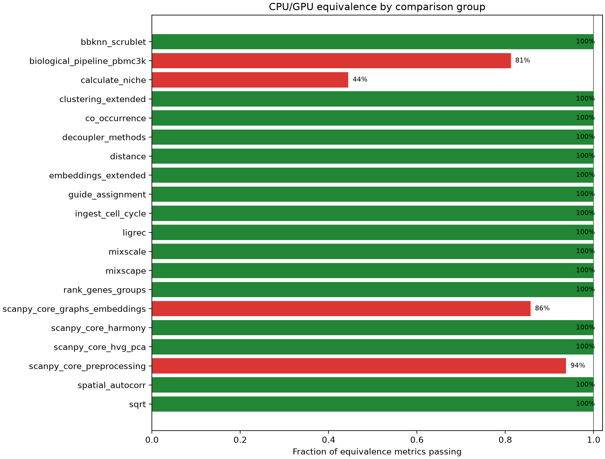

# CPU/GPU equivalence report

Generated 2026-07-31T22:38:44.100681+00:00 from isolated comparison processes.

## Outcome

- Overall: **FAIL**
- Method groups passing: **16/20**
- Metrics passing: **200/210**
- Scripts completing successfully: **16/20**

## Software versions

| Package | Version(s) |
| --- | --- |
| decoupler | 2.2.0 |
| harmonypy | 0.2.0 |
| pertpy | 1.1.1 |
| rapids-singlecell | 0.16.1 |
| scanpy | 1.12.3 |
| squidpy | 1.8.3 |

## Method groups

| Method group | Reference | Dataset | Tier | Result | Metrics |
| --- | --- | --- | --- | --- | ---: |
| `bbknn_scrublet` | scanpy | pbmc68k_reduced + pbmc3k | stochastic | PASS | 5/5 |
| `biological_pipeline_pbmc3k` | scanpy | pbmc3k_processed raw log-expression with published cell-type labels | biological | FAIL | 13/16 |
| `calculate_niche` | squidpy | squidpy.datasets.imc | stochastic | FAIL | 4/9 |
| `clustering_extended` | scanpy | scanpy.datasets.pbmc68k_reduced | stochastic | PASS | 4/4 |
| `co_occurrence` | squidpy | squidpy.datasets.imc | deterministic | PASS | 4/4 |
| `decoupler_methods` | decoupler | decoupler.ds.toy | deterministic | PASS | 18/18 |
| `distance` | pertpy | seeded grouped Gaussian data | deterministic | PASS | 18/18 |
| `embeddings_extended` | scanpy | scanpy.datasets.pbmc68k_reduced | stochastic | PASS | 6/6 |
| `guide_assignment` | pertpy | seeded Poisson guide-count mixture | near-deterministic | PASS | 3/3 |
| `ingest_cell_cycle` | scanpy | scanpy.datasets.pbmc68k_reduced | near-deterministic | PASS | 6/6 |
| `ligrec` | squidpy | scanpy.datasets.paul15 | stochastic | PASS | 4/4 |
| `mixscale` | pertpy | seeded synthetic perturbation screen | deterministic | PASS | 2/2 |
| `mixscape` | pertpy | seeded synthetic perturbation screen | near-deterministic | PASS | 5/5 |
| `rank_genes_groups` | scanpy | scanpy.datasets.pbmc68k_reduced | near-deterministic | PASS | 60/60 |
| `scanpy_core_graphs_embeddings` | scanpy | pbmc68k_reduced | stochastic | FAIL | 6/7 |
| `scanpy_core_harmony` | harmonypy | Harmonypy PBMC 3,500-cell donor benchmark | iterative | PASS | 3/3 |
| `scanpy_core_hvg_pca` | scanpy | pbmc3k | deterministic | PASS | 19/19 |
| `scanpy_core_preprocessing` | scanpy | pbmc3k | deterministic | FAIL | 15/16 |
| `spatial_autocorr` | squidpy | squidpy.datasets.imc | deterministic | PASS | 4/4 |
| `sqrt` | scanpy | scanpy.datasets.pbmc3k | deterministic | PASS | 1/1 |

## Failed metrics

| Method group | Metric | Observed | Criterion |
| --- | --- | ---: | --- |
| `biological_pipeline_pbmc3k` | `umap.cpu.trustworthiness` | 0.86987076 | >= 0.9 |
| `biological_pipeline_pbmc3k` | `umap.gpu.trustworthiness` | 0.8698258 | >= 0.9 |
| `biological_pipeline_pbmc3k` | `umap.cross_embedding_knn_overlap` | 0.40189538 | >= 0.6 |
| `calculate_niche` | `neighborhood.adjusted_rand_index` | 0.85900898 | >= 0.9 |
| `calculate_niche` | `neighborhood.normalized_mutual_information` | 0.80667388 | >= 0.9 |
| `calculate_niche` | `neighborhood.cluster_count_difference` | 11 | <= 1 |
| `calculate_niche` | `utag.adjusted_rand_index` | 0.55462722 | >= 0.85 |
| `calculate_niche` | `utag.normalized_mutual_information` | 0.73327271 | >= 0.85 |
| `scanpy_core_graphs_embeddings` | `umap.cross_embedding_knn_overlap` | 0.58847619 | >= 0.65 |
| `scanpy_core_preprocessing` | `normalize_total.max_abs_error` | 0.00012207031 | <= 1e-05 |

## Incomplete or failing scripts

| Script | Exit code | Result record | Log |
| --- | ---: | --- | --- |
| `scanpy_core/preprocessing.py` | 1 | yes | [logs/scanpy_core__preprocessing.py.log](logs/scanpy_core__preprocessing.py.log) |
| `scanpy_core/graphs_embeddings.py` | 1 | yes | [logs/scanpy_core__graphs_embeddings.py.log](logs/scanpy_core__graphs_embeddings.py.log) |
| `biological_pipeline/pbmc3k.py` | 1 | yes | [logs/biological_pipeline__pbmc3k.py.log](logs/biological_pipeline__pbmc3k.py.log) |
| `squidpy/calculate_niche.py` | 1 | yes | [logs/squidpy__calculate_niche.py.log](logs/squidpy__calculate_niche.py.log) |

## Reviewer-facing evidence

| Reviewer request | Evidence in this report |
| --- | --- |
| Numerical equivalence for deterministic methods | Absolute error and correlation for preprocessing, HVG, PCA, spatial statistics, activity inference, and perturbation methods |
| Biological equivalence for stochastic methods | Label-invariant ARI/NMI, embedding trustworthiness, and neighborhood overlap |
| Explicit clustering agreement | Leiden, Louvain, k-means, and spatial-niche ARI/NMI |
| Explicit marker preservation | Per-cell-type top-50 overlap and score agreement |
| Explicit embedding comparison | Quantitative overlap plus side-by-side biological-pipeline UMAPs |
| Cell-type interpretation | Held-out annotation accuracy and CPU/GPU prediction agreement |
| Additional scverse APIs | Direct Squidpy, Decoupler, and Pertpy reference comparisons |

Raw metric records are available in [`metrics.csv`](metrics.csv) and [`equivalence.json`](../equivalence.json).
Automatic publication of this report requires GPU-backed CI, either through a self-hosted GPU runner or a CI-to-Slurm integration.
